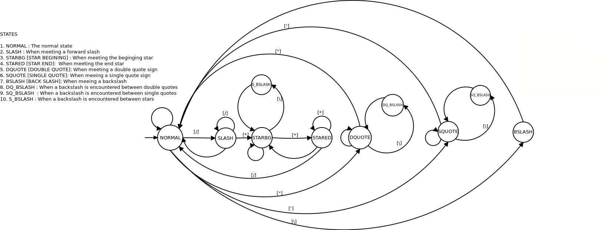

# De-Comment Program

C program to remove comments from source-code

## DFA Design

The deterministic finite state automaton (DFA) expresses the required de-commenting logic. The DFA is represented using the traditional "labeled ovals and labeled arrows" notation. Each oval represent a state. Each state is given short name with detailed descriptions of the left. Each arrow represent a transition from one state to another. Each arrow is labeled with the single character that causes the transition to occur.



## Build

You can compile the program using `gcc`.

```shell
$ gcc decomment.c -o decomment
```

## Usage

```shell
$ ./decomment <file_path>
```

- If the program is run without <file_path> argument, the code to be decommented will be read from the
  standard input and displayed[decommented code] on the standard output

- If <file_path> argument is given, the code to be decommented will be read form the file and displayed in
  the standard output.

## Test

`test.py` contains a simple script to run the compiled `decomment` program and compare the standard output
against expected output values. To run, execute run the following command after compiling the `decomment`
program:

```shell
$ python test.py
```

## License

MIT © [Eyuel Berga](https://github.com/eyuelberga)
